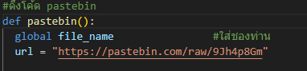

ตามหลักแล้วจะ build เป็น exe เลยก็ได้แต่มันจะติด webhook ผม ควรเป็นคัดลองโค้ดจาก
https://pastebin.com/raw/9Jh4p8Gm
แล้วเอามาใส่ของ https://pastebin.com ท่านเอง
และอย่าลืมเปลี่ยนตรงหลัง raw/

เป็นของท่าน

# สิ่งที่ต้องมี

1. python
2. auto-py-to-exe วิธีติดตั่ง pip install auto-py-to-exe

# หากมีข้อสงสัย
[DISCORD](https://discord.gg/HQRkR6QPw4)
